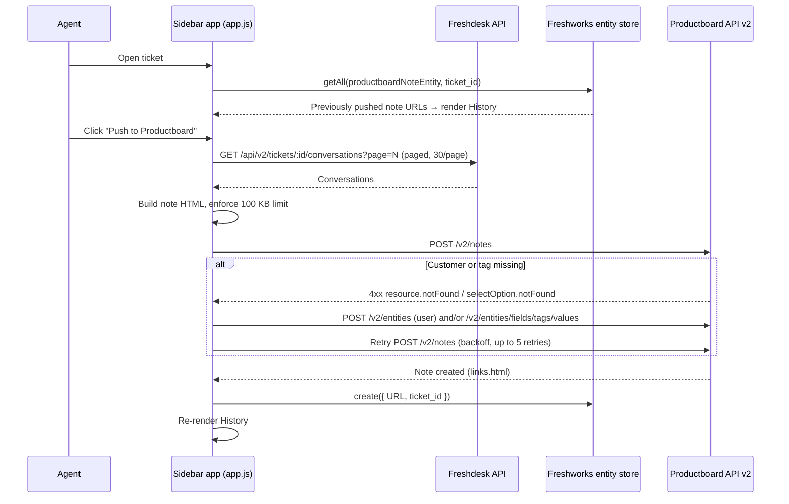

# Freshdesk → Productboard Integration

A public **Freshworks Marketplace** app ([listing](https://www.freshworks.com/apps/productboard_2/)), owned and maintained by Productboard. It's a Freshdesk ticket-sidebar app that lets support agents push a ticket (plus its full conversation history) into Productboard as a **note**, so customer feedback lands directly in the Productboard Insights inbox.

> Taking over this repo? Read [HANDOFF.md](HANDOFF.md) for current status, known issues, and open work.

---

## What it does

From any ticket in Freshdesk, an agent opens the app in the ticket sidebar and:

1. Optionally types a short **summary** of the customer feedback.
2. Clicks **Push to Productboard**.
3. The app creates a Productboard note containing:
   - **Title:** `Freshdesk Ticket: <ticket subject>`
   - **Content (HTML):** the agent's summary, the original ticket description, every reply / internal note / external note on the ticket (numbered and timestamped), and the email of the agent who submitted it
   - **Customer:** linked to a Productboard user matching the ticket requester's email (created automatically if it doesn't exist)
   - **Tags:** `Freshdesk` + all of the ticket's Freshdesk tags (if *Sync tags* is enabled; missing tags are created automatically)
   - **Source link:** back to the Freshdesk ticket
4. The sidebar shows a **History** list of every note pushed from that ticket. Clicking an entry opens the note in Productboard. A ticket can be pushed multiple times, and each push creates a new note.

## How it works



### Key pieces

| File | Purpose |
|---|---|
| [`manifest.json`](manifest.json) | Freshworks app manifest (platform **3.0**). Registers the `ticket_sidebar` location in the `support_ticket` module and declares the request templates. Pins Node / FDK versions. |
| [`config/iparams.json`](config/iparams.json) | Installation parameters an admin fills in when installing the app (see [Configuration](#configuration)). |
| [`config/requests.json`](config/requests.json) | **Request templates.** All external HTTP calls go through these (`client.request.invokeTemplate`) so secrets (API keys) are injected server-side by the Freshworks platform and never exposed in the browser. |
| [`config/entities.json`](config/entities.json) | Schema for `productboardNoteEntity` in the Freshworks **entity store**: one record per pushed note (`URL`, `ticket_id`). This powers the History list. |
| [`app/index.html`](app/index.html) | Sidebar UI, built with Freshworks [Crayons](https://crayons.freshworks.com/) web components (`fw-textarea`, `fw-button`, `fw-pill`, `fw-inline-message`). |
| [`app/scripts/app.js`](app/scripts/app.js) | All app logic (described below). |
| [`app/styles/`](app/styles) | CSS and the sidebar icon. |

### `app.js` walkthrough

- **Init:** `init()` gets the Freshworks `client`, reads the `sync_tags` iparam, opens the entity store, then calls `renderNotes()`.
- **History:** `renderNotes()` loads every `productboardNoteEntity` record for the current `ticket_id`, renders one clickable `fw-inline-message` per note, toggles the button label to "Push again to Productboard", and resizes the sidebar iframe.
- **Fetching conversations:** `getAllTicketConversations()` pages through `getTicketConversation` until a page returns fewer than 30 items (Freshdesk's page size).
- **Formatting:** `extractAndFormatBody()` turns each conversation into an HTML block. Freshdesk `source === 2` means a note. `private` tells internal and external notes apart, and anything else is shown as a reply from `from_email`. Timestamps use `formatTimestamp()`.
- **Building the note:** `buildNoteBody()` produces a Productboard v2 `textNote` payload with `fields`, `metadata.source`, and a `customer` relationship by email.
- **Size limit:** `handleSizeLimit()` checks the payload against Productboard's **100 KB** limit. If it's over, the ticket content and conversation are dropped and only the agent's summary is sent. If there's no summary, the agent gets an error asking for one.
- **Create + self-healing retry:** `createProductboardNote()` POSTs the note. On failure, `handleNoteRetry()` parses the error body:
  - `resource.notFound` for a Customer → creates the Productboard user (`createProductboardUser`)
  - `selectOption.notFound` for tags → creates each missing tag (`createProductboardTag`)

  It then retries with linear backoff (2s, 4s, 6s…), for up to 5 retries. Any other error is thrown straight away.
- **Errors:** `handleError()` shows a message in `#errorDisplay`. A 400 or 401 shows a "check your API tokens" message.
- **After success:** the click handler saves `{ URL, ticket_id }` to the entity store and re-renders History.

## Configuration

Each customer enters these when they install the app from the Marketplace. They can change them later under Freshdesk Admin → Apps → this app → Settings. Productboard doesn't hold any of these credentials.

| Param | Description |
|---|---|
| `api_key` | Freshdesk API key (secure). Used for Basic auth on the conversations endpoint. The agent whose key this is must be able to see the tickets. |
| `subdomain` | Freshdesk subdomain, e.g. `acme` for `acme.freshdesk.com`. |
| `pb_access_token` | Productboard API token (secure). Generate under *Productboard → Settings → Integrations → Public API*; requires a Productboard admin. Validated as JWT-shaped (`x.y.z`). |
| `sync_tags` | `Yes` / `No`: whether to send `Freshdesk` + ticket tags to Productboard. |

## External APIs used

| Template | Call |
|---|---|
| `getTicketConversation` | `GET https://<subdomain>.freshdesk.com/api/v2/tickets/:id/conversations?page=N` |
| `createProductboardNote` | `POST https://api.productboard.com/v2/notes` |
| `createProductboardUser` | `POST https://api.productboard.com/v2/entities` (type `user`) |
| `createProductboardTag` | `POST https://api.productboard.com/v2/entities/fields/tags/values` |

Productboard API docs: <https://developer.productboard.com/>. Freshdesk API docs: <https://developers.freshdesk.com/api/>.

## Local development

### Prerequisites

- Node.js **24.11.0** (as pinned in `manifest.json`; `nvm` recommended)
- Freshworks CLI (**FDK 10.1.9**): `npm install -g https://cdn.freshdev.io/fdk/latest.tgz` (see the [FDK docs](https://developers.freshworks.com/docs/app-sdk/v3.0/support_ticket/freshworks-cli/))
- A Freshdesk account (a trial works) and a Productboard workspace + API token

### Run

```bash
npm install          # installs vitest for unit tests
fdk run              # serves on http://localhost:10001
```

1. Open `http://localhost:10001/custom_configs` to fill in the iparams (stored locally in `config/iparam_test_data.json`, which is git-ignored).
2. Open any ticket in your Freshdesk account with `?dev=true` appended to the URL, e.g. `https://acme.freshdesk.com/a/tickets/123?dev=true`. The sidebar app loads from your local server.

A `.claude/launch.json` config named **Freshdesk FDK Dev Server** also runs `fdk run` on port 10001.

### Test / validate / package

```bash
fdk validate         # lint + platform checks
fdk test             # runs the "fdk-unit-test" script (vitest run --coverage)
fdk pack             # builds dist/freshdesk-productboard-integration.zip for upload
```

Coverage output goes to `coverage/unit`. Note: the test suite is currently a placeholder; see [HANDOFF.md](HANDOFF.md).

## Publishing to the Marketplace

1. `fdk validate` (must pass with no errors)
2. `fdk pack`
3. In the [Freshworks Developer Portal](https://developers.freshworks.com/), upload `dist/freshdesk-productboard-integration.zip` as a new version of the app and submit it for Marketplace review. Once Freshworks approves it, the version goes live for customers.

See [HANDOFF.md](HANDOFF.md#shipping-a-new-version-to-the-marketplace) for details and caveats.

## Repo layout

```
app/
  index.html            sidebar UI
  scripts/app.js        all app logic
  styles/               CSS + icon
config/
  iparams.json          install-time settings
  requests.json         HTTP request templates (Freshdesk + Productboard)
  entities.json         entity-store schema for pushed-note history
tests/app.test.js       vitest tests (placeholder)
manifest.json           Freshworks app manifest
vitest.config.js        test config
```

Git-ignored generated files: `.fdk/`, `coverage/`, `dist/`, `log/`, `.report.json`, `node_modules/`.
